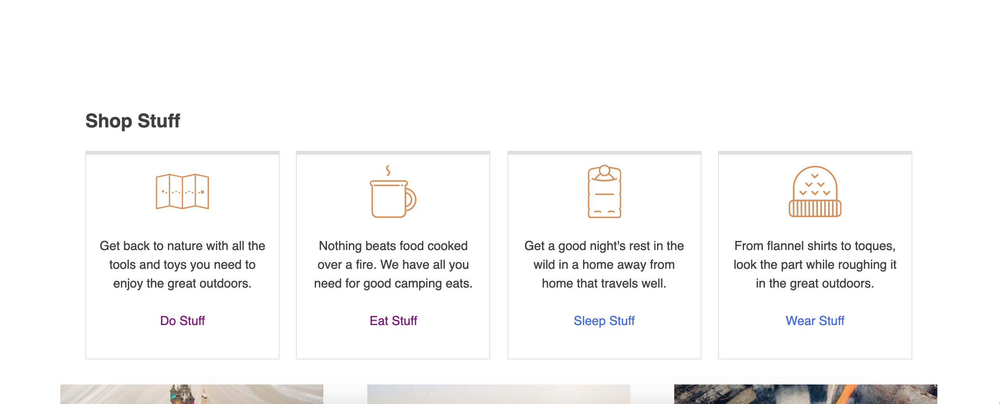
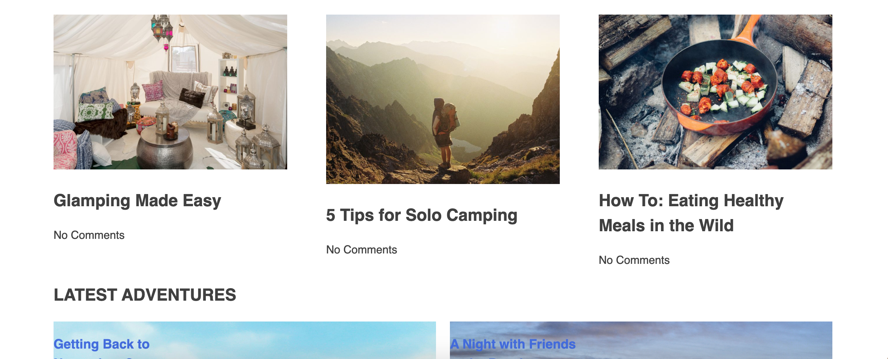
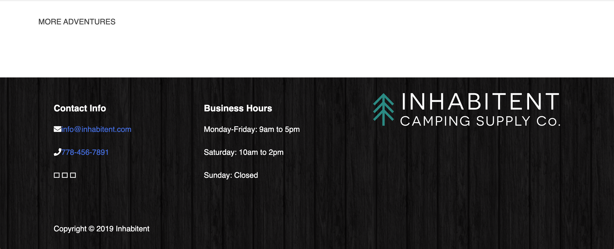

# Inhabitent

A WordPress theme made with Red Academy. This is also my first wordpress theme.

## Summary / Purpose

The Inhabitent project is my first attempt/run through of making a custom Wordpress theme.

## Author: Abdullah Rahman

## Notable learnings include:

- The Wordpress template hierarchy
- Creating custom pages and taxonomies
- Creating and using field groups
- Styling a multipage project

The development of this website allowed for practice developing a custom wordpress theme. It also gave me a chance to improve my skills in css and php as well as small amounts of jQuery. It also includes a custom widget and plugin. With this project, I was able to understand Custom Post Types and Custom Taxonomies, that help us organize our Wordpress in a more efficient way.

## Technologies Used

- Wordpress
- PHP
- HTML and SCSS
- jQuery

## Acknowldgements:

Acknowledgements to Red Academy instructors Jim and his associates.
